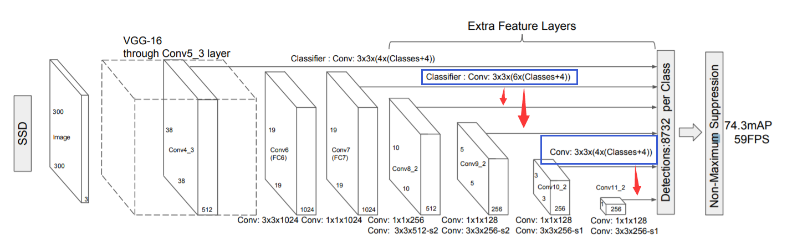

# 目标检测常用网络笔记
下面根据d2l一书中的介绍简单记录一下各个网络模型的特点，由于书中详细介绍了一个简易的SSD，因此这篇笔记主要以SSD为主，R-CNN系列概括其思想，YOLO系列书中未提及，内容主要源于网上的分享。
<!-- more -->

## SSD

单发多框检测（single shot multibox detection，SSD）简单、快速，并得到了广泛应用。该模型的一些设计思想和实现细节常适用于其他目标检测模型。

### 网络结构



首先特征提取网络选用了VGG-16，后面继续使用卷积来缩小特征图以获得多尺度，此外还设计了6个多尺度检测模块来生成锚框。Conv:3x3x(4x(Classes+4))中，3x3是卷积核大小(d2l中padding为1)，4为锚框数量，Classes+4中的4为offsets。由此可以看出，SSD在每个类别的探测锚框数为:
$$
38\times 38\times 4 + 19\times 19 \times 6 + 10\times 10\times 6+ 5\times 5\times 6 + 3\times 3 \times4 + 1\times 1\times 4 = 8732
$$

### 锚框的参数

锚框主要有两个参数——scale与ratio。在论文中，作者提到，scale由以下公式计算：
$$
s_{k}=s_{\min }+\frac{s_{\max }-s_{\min }}{m-1}(k-1), \quad k \in[1, m]
$$
其中m为用于探测的fmap个数，SSD300（上图）中为6，k为当前的fmap索引。不难发现，一开始scale比较小，fmap也比较大，可以用于探测小物体，后面锚框逐渐变大，用于探测大物体。

由于每个fmap的scale是固定的，因此锚框的个数主要由ratio个数决定。作者选取了5个ratio（1,2,3,1/2,1/3），其中在某些fmap丢弃3与1/3的ratio，对于ratio为1的情况，还增加了一个$scale=\sqrt{s_{k} s_{k+1}}$的锚框，总共形成6个锚框（部分4个）。为了使锚框中心位于像素中心，计算坐标时还加了0.5的偏置，公式为：
$$
\left(\frac{i+0.5}{\left|f_{k}\right|}, \frac{j+0.5}{\left|f_{k}\right|}\right)
$$
其中$|f_k|$是第k个fmap的大小，i,j为像素索引，$i, j \in\left[0,\left|f_{k}\right|\right)$

### 锚框的标注

锚框的标注仍使用IoU最大的先匹配，优先匹配完所有的gt bbox。随后，对于剩余的锚框，若最大IoU大于0.5，也进行相应匹配。匹配的同时标注类别，计算offset。

### 模型预测

在模型预测方面，使用特定fmap33same卷积后的结果，设置一定的通道数。设目标的类别个数为$q$。每个锚框的类别个数将是$q+1$，其中类别0表示锚框只包含背景。在某个尺度下，设特征图的高和宽分别为$h$和$w$，如果以其中每个单元为中心生成$a$个锚框，那么我们需要对$hwa$个锚框进行分类。如果使用全连接层作为输出，很容易导致模型参数过多。因此可以使用3x3的same卷积，类别输出通道数为$a\times(q+1)$，对应每个像素a个锚框在q+1类的score，offset输出通道数为$a\times4$，对应每个像素a个锚框的4个偏置。

d2l中使用`cls_predictor`来预测类别，`bbox_predictor`来预测偏置：

```python
def cls_predictor(num_inputs, num_anchors, num_classes):
    return nn.Conv2d(num_inputs, num_anchors * (num_classes + 1),
                     kernel_size=3, padding=1)

def bbox_predictor(num_inputs, num_anchors):
    return nn.Conv2d(num_inputs, num_anchors * 4, kernel_size=3, padding=1)
```

在编程时，卷积后输出为 (batch size, number of channels, height, width)，后三个维度可能不同层输出不一样，无法合并结果。d2l中的策略是，将channels（预测结果）调到最后一个维度，然后将这三个维度合并，只留下两个维度，后期使用结果是只需要reshape成（batch size，-1， num_classes + 1）或者（batch size，-1， 4）。第二个维度自然会变成锚框个数。

### 完整的简易模型

d2l中，作者实现了一个简易版的SSD模型，代码如下：

```python
sizes = [[0.2, 0.272], [0.37, 0.447], [0.54, 0.619], [0.71, 0.79],
         [0.88, 0.961]]
ratios = [[1, 2, 0.5]] * 5
num_anchors = len(sizes[0]) + len(ratios[0]) - 1

def base_net():
    blk = []
    num_filters = [3, 16, 32, 64]
    for i in range(len(num_filters) - 1):
        blk.append(down_sample_blk(num_filters[i], num_filters[i+1]))
    return nn.Sequential(*blk)

def down_sample_blk(in_channels, out_channels):
    blk = []
    for _ in range(2):
        blk.append(nn.Conv2d(in_channels, out_channels,
                             kernel_size=3, padding=1))
        blk.append(nn.BatchNorm2d(out_channels))
        blk.append(nn.ReLU())
        in_channels = out_channels
    blk.append(nn.MaxPool2d(2))
    return nn.Sequential(*blk)

def get_blk(i):
    if i == 0:
        blk = base_net()
    elif i == 1:
        blk = down_sample_blk(64, 128)
    elif i == 4:
        blk = nn.AdaptiveMaxPool2d((1,1))
    else:
        blk = down_sample_blk(128, 128)
    return blk

def blk_forward(X, blk, size, ratio, cls_predictor, bbox_predictor):
    Y = blk(X)
    anchors = d2l.multibox_prior(Y, sizes=size, ratios=ratio)
    cls_preds = cls_predictor(Y)
    bbox_preds = bbox_predictor(Y)
    return (Y, anchors, cls_preds, bbox_preds)

class TinySSD(nn.Module):
    def __init__(self, num_classes, **kwargs):
        super(TinySSD, self).__init__(**kwargs)
        self.num_classes = num_classes
        idx_to_in_channels = [64, 128, 128, 128, 128]
        for i in range(5):
            # The assignment statement is self.blk_i = get_blk(i)
            setattr(self, f'blk_{i}', get_blk(i))
            setattr(self, f'cls_{i}', cls_predictor(idx_to_in_channels[i], num_anchors, num_classes))
            setattr(self, f'bbox_{i}', bbox_predictor(idx_to_in_channels[i], num_anchors))

    def forward(self, X):
        anchors, cls_preds, bbox_preds = [None] * 5, [None] * 5, [None] * 5
        for i in range(5):
            # getattr(self, 'blk_%d' % i) accesses self.blk_i
            X, anchors[i], cls_preds[i], bbox_preds[i] = blk_forward(
                X, getattr(self, f'blk_{i}'), sizes[i], ratios[i],
                getattr(self, f'cls_{i}'), getattr(self, f'bbox_{i}'))
        # In the reshape function, 0 indicates that the batch size remains
        # unchanged
        anchors = torch.cat(anchors, dim=1)
        cls_preds = concat_preds(cls_preds)
        cls_preds = cls_preds.reshape(cls_preds.shape[0], -1, self.num_classes + 1)
        bbox_preds = concat_preds(bbox_preds)
        return anchors, cls_preds, bbox_preds
```

### 数据增强

论文中作者提到，模型训练时使用了不同策略的数据增强以防止过拟合。策略主要有随机裁剪、水平翻转、形变等。

### 损失函数

模型的损失函数主要有两部分组成，分别为位置损失（localization loss）与类别损失（confidence loss）。
$$
L(x, c, l, g)=\frac{1}{N}\left(L_{\operatorname{conf}}(x, c)+\alpha L_{l o c}(x, l, g)\right)
$$
其中，$\alpha$设为1。$L_{conf}$选用交叉熵损失函数，$L_{loc}$使用Smooth L1函数：
$$
\begin{aligned}
L_{l o c}(x, l, g)=\sum_{i \in P o s}^{N} \sum_{m \in\{c x, c y, w, h\}}  x_{i j}^{k} \operatorname{smooth}_{\mathrm{L} 1}\left(l_{i}^{m}-\hat{g}_{j}^{m}\right) \\
\hat{g}_{j}^{c x}=\left(g_{j}^{c x}-d_{i}^{c x}\right) / d_{i}^{w} \quad \hat{g}_{j}^{c y}=\left(g_{j}^{c y}-d_{i}^{c y}\right) / d_{i}^{h} \\
\hat{g}_{j}^{w}=\log \left(\frac{g_{j}^{w}}{d_{i}^{w}}\right) \quad \hat{g}_{j}^{h}=\log \left(\frac{g_{j}^{h}}{d_{i}^{h}}\right)
\end{aligned}
$$

### Hard negative mining

在进行锚框标注后，可能会出现大量的负样本，造成负样本数量远大于正样本，因此作者使用了Hard negative mining的策略。

对负样本分类时候，loss比较大（label与prediction相差较大）的那些样本，也可以说是容易将负样本看成正样本的那些样本，例如锚框里没有物体，全是背景，这时候分类器很容易正确分类成背景，这个就叫easy negative；如果锚框里有二分之一个物体，标签仍是负样本，这时候分类器就容易把他看成正样本，这时候就是hard negative。

作者把负样本中的$L_{conf}$进行排序，只保留loss较大的负样本，使正负样本比例最多为1:3。

### 总结

总的来说，SSD具有如下主要特点：

- 目标检测速度是比较快

- 从YOLO中继承了将detection转化为regression的思路，一次完成目标定位与分类
- 基于Faster RCNN中的Anchor，提出了相似的Prior box
- 运用了多尺度的检测方式
- 锚框的生成依赖于scale与ratio这两个超参数

## R-CNN系列

下面简要概括d2l中对R-CNN的描述。

### R-CNN

R-CNN主要由以下4步构成：


1. 对输入图像使用选择性搜索（selective search）来选取多个（2k个）高质量的具有不同的形状和大小提议区域（Region Proposal），并进行标注。

2. 选取一个预训练的卷积神经网络，并通过前向计算输出抽取的提议区域特征。

3. 将每个提议区域的特征连同其标注的类别作为一个样本，训练多个支持向量机对目标分类。其中每个支持向量机用来判断样本是否属于某一个类别。

4. 将每个提议区域的特征连同其标注的边界框作为一个样本，训练线性回归模型来预测真实边界框。

   R-CNN虽然通过预训练的卷积神经网络有效抽取了图像特征，但它的主要缺点是速度慢，因为每个提议区域都必须经过CNN提取特征。

### Fast R-CNN

Fast R-CNN对R-CNN的一个主要改进在于只对整个图像做卷积神经网络的前向计算。


其中池化层（region of interest pooling）的输出大小是可以指定的，这样可以将不同形状的Region Proposal转化为统一大小，以便于后续的预测。

### Faster R-CNN


Fast R-CNN通常需要在选择性搜索中生成较多的提议区域，以获得较精确的目标检测结果。Faster R-CNN提出将选择性搜索替换成区域提议网络（region proposal network），从而减少提议区域的生成数量，并保证目标检测的精度。

## YOLO系列

YOLO(You Only Look Once)系列与SSD一样采用一步到位的策略（one-stage），没有先产生region proposal再去分类。YOLO系列v1至v3由Joseph Redmon等人提出，后续作者不再更新网络，由Alexey Bochkovskiy提出了v4，另外v5版本存在一定争议，作者没有发表论文，只提供了代码。由于YOLO版本较多，自己了解不深，这里主要收集展示一些自己认为写得比较好的博客。

v1（划分网格，预测坐标类别等）：https://blog.csdn.net/lipengfei0427/article/details/103589165

v2（引入anchor box，将最后的全连接层改为全卷积层）、v3（加深网络、多尺度预测、更换logistics loss）：https://blog.csdn.net/lipengfei0427/article/details/103726333

v3、v4（总结并提出大量技巧进行实验得出最佳组合）：https://blog.csdn.net/nan355655600/article/details/106246625

v5：https://blog.csdn.net/nan355655600/article/details/107852353

v1-v4的发展史：https://zhuanlan.zhihu.com/p/139128562

v3的pytorch实现：https://zhuanlan.zhihu.com/p/137797393

同时附上Redmon论文中V1的网络结构：


## 参考资料

- <https://zh.d2l.ai/chapter_computer-vision/ssd.html#%E5%8D%95%E5%8F%91%E5%A4%9A%E6%A1%86%E6%A3%80%E6%B5%8B%EF%BC%88SSD%EF%BC%89>
- <https://d2l.ai/chapter_computer-vision/ssd.html>
- <https://d2l.ai/chapter_computer-vision/rcnn.html>
- <https://arxiv.org/pdf/1512.02325.pdf>  （SSD）
- <https://www.zhihu.com/question/46292829/answer/284236956>
- <https://blog.csdn.net/weixin_42273095/article/details/81699352>
- <https://zhuanlan.zhihu.com/p/31427288>
- <https://arxiv.org/pdf/1311.2524.pdf>  （R-CNN）
- <https://arxiv.org/pdf/1504.08083.pdf>  （Fast R-CNN）
- <https://arxiv.org/pdf/1506.01497.pdf>  （Faster R-CNN）
- <https://arxiv.org/pdf/1506.02640.pdf>  （YOLO）
- <https://arxiv.org/pdf/1612.08242.pdf>  （YOLOv2/9000）
- <https://arxiv.org/pdf/1804.02767.pdf>  （YOLOv3）
- <https://arxiv.org/pdf/2004.10934.pdf>  （YOLOv4）